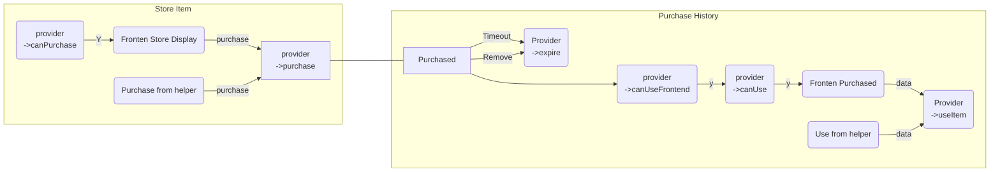

# Store-template

Template of store provider. This is not a plugin that can be install but used to create a new plugin for [xypp/store](https://github.com/zxy19/store)

## Store Item's life cycle

- requires mermaid

## Develop

### backend

Plugins could extend store by offering StoreProvider extends AbstractStoreProvider. See `StoreProvider.php`

### frontend

This project contains a file named `StoreHelper.ts`, which has described all methods the Store exports.
